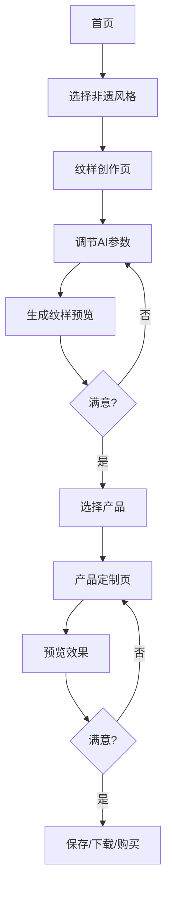

## 1. Product Overview
AI非遗纹样设计平台是一款通过AI技术赋能用户创作具有中国传统非遗风格（蓝印花布、剪纸、刺绣等）文创产品的设计工具。平台将传统美学与现代设计技术相结合，让用户能够便捷地将非遗纹样应用于书签、手机壳、丝巾等各类产品。

- **核心目标**: 传承与创新中国非遗文化，让传统纹样在现代生活中焕发新生
- **目标用户**: 文创设计师、非遗爱好者、普通消费者、文化机构
- **市场价值**: 填补AI技术与非遗文化结合的空白，为文化创意产业提供新的创作工具

## 2. Core Features

### 2.1 User Roles
| Role | Registration Method | Core Permissions |
|------|---------------------|------------------|
| Guest | No registration | Browse works, preview designs |
| Registered User | Email/phone registration | Create designs, save works, download designs |
| Premium User | Subscription | Advanced AI features, unlimited downloads, commercial license |

### 2.2 Feature Module
1. **首页**: 品牌展示、非遗风格预览、热门作品推荐、快速入口
2. **纹样创作页**: 非遗风格选择、AI参数调节、纹样预览与编辑
3. **产品定制页**: 产品选择、纹样应用、定制预览、下单
4. **作品展示页**: 个人作品管理、作品分享、社区展示

### 2.3 Page Details
| Page Name | Module Name | Feature description |
|-----------|-------------|---------------------|
| 首页 | Hero区域 | 品牌视觉展示、卷轴展开动效、核心功能介绍 |
| 首页 | 非遗风格展示 | 扇面形式展示蓝印花布、剪纸等风格选项 |
| 首页 | 热门作品 | 卡片式展示用户优秀作品，支持点击查看详情 |
| 纹样创作页 | 风格选择区 | 传统扇面/卷轴形式展示非遗风格选项 |
| 纹样创作页 | AI参数调节区 | 古琴琴弦/竹简风格的参数控件 |
| 纹样创作页 | 预览区 | 画框/卷轴形式的预览容器 |
| 产品定制页 | 产品选择区 | 博古架形式展示可定制产品 |
| 产品定制页 | 定制区 | 符合传统美学的定制控制面板 |
| 产品定制页 | 效果展示区 | 多角度产品展示，移步换景效果 |
| 作品展示页 | 作品网格 | 瀑布流展示用户作品 |
| 作品展示页 | 作品详情 | 放大查看、分享、下载功能 |

## 3. Core Process
用户进入首页 → 选择非遗风格 → 进入纹样创作页 → 调节AI参数生成纹样 → 选择产品类型 → 预览效果 → 保存/下载/购买

## 4. User Interface Design

### 4.1 Design Style
- **主色调**: 故宫红墙(#9E1F36)、明黄瓦(#F4C430)、藏青(#1A365D)、墨黑(#1A1A1A)、宣纸白(#F5F0E6)
- **辅助色**: 各主色衍生3-5级明度变化
- **按钮风格**: 印章式设计，圆角矩形，悬停时有盖印动效
- **字体**: 标题使用书法字体，正文使用宋体/黑体，强调文字使用篆刻印章风格
- **布局风格**: 卡片式布局，传统纹样边框装饰
- **背景**: 宣纸纹理(8-15%透明度)，局部山水墨迹底纹

### 4.2 Page Design Overview

| Page Name | Module Name | UI Elements |
|-----------|-------------|-------------|
| 首页 | Hero区域 | 宣纸纹理背景、卷轴展开动画、书法标题、印章按钮 |
| 首页 | 风格展示 | 扇面造型卡片、祥云纹边框、悬停放大效果 |
| 首页 | 作品推荐 | 回字纹边框卡片、瀑布流布局、墨色渐变背景 |
| 纹样创作页 | 风格选择 | 卷轴式横向滚动、传统纹样装饰、悬停高亮 |
| 纹样创作页 | 参数调节 | 古琴琴弦式滑块、竹简式选项卡、水墨风格控件 |
| 纹样创作页 | 预览区 | 画框式容器、宣纸质感、光影流动动效 |
| 产品定制页 | 产品选择 | 博古架造型、分层展示、3D旋转预览 |
| 产品定制页 | 定制区 | 传统风格控制面板、印章按钮、墨迹过渡 |
| 作品展示页 | 作品网格 | 冰裂纹分隔、统一卡片样式、悬停显示操作 |

### 4.3 Responsiveness
- **桌面端**: 完整功能展示，多栏布局
- **平板端**: 自适应布局，减少侧边栏
- **移动端**: 单栏布局，底部导航，简化控件

### 4.4 Animation Effects
- **页面切换**: 卷轴展开、书页翻动效果
- **加载状态**: 墨迹扩散动画
- **交互反馈**: 印章盖印效果
- **过渡动画**: 光影流动效果，速度0.6-1.2秒
