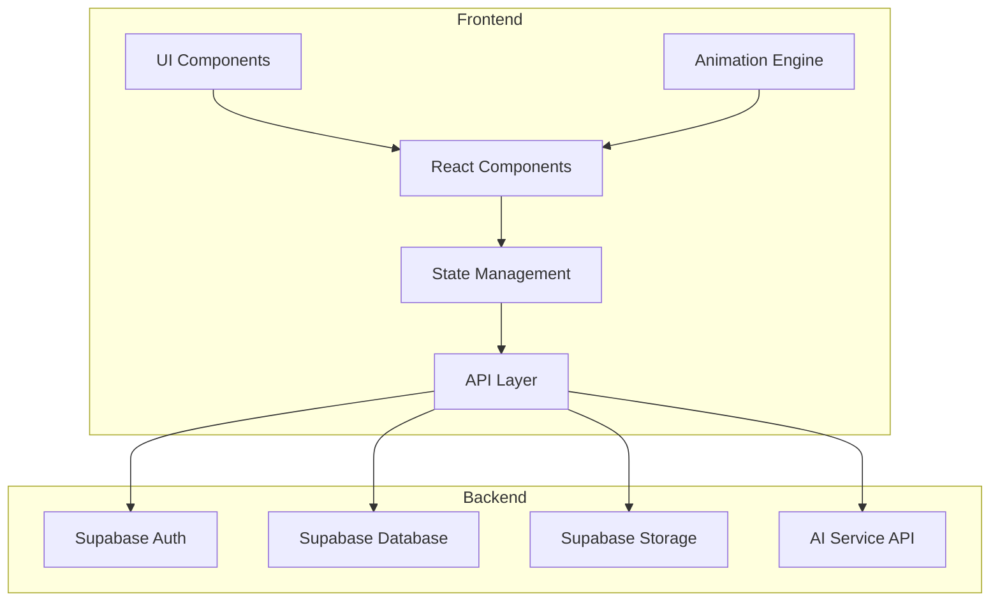
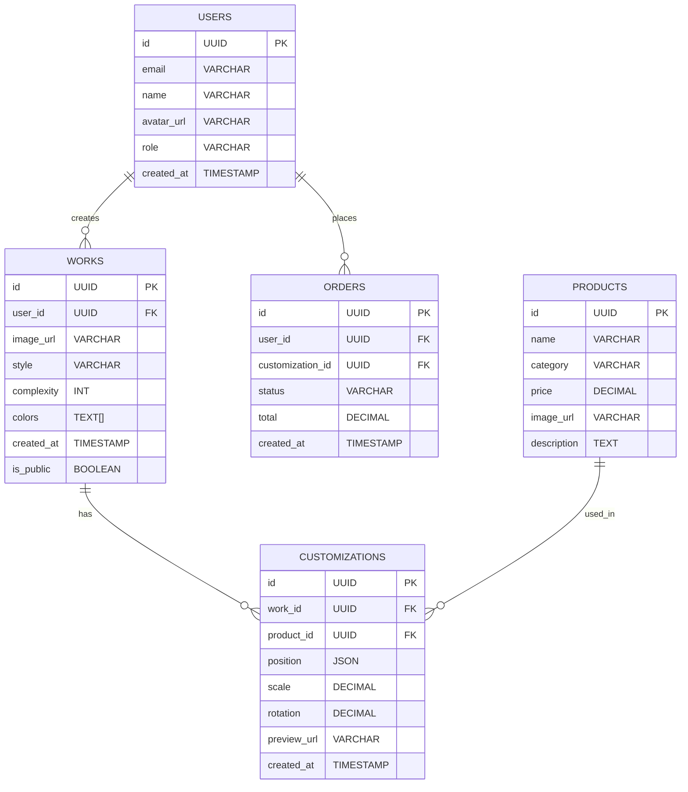

## 1. Architecture Design



## 2. Technology Description
- **Frontend**: React@18 + TypeScript + TailwindCSS@3 + Vite
- **State Management**: Zustand
- **Routing**: React Router DOM
- **Animation**: Framer Motion + CSS Animations
- **Backend**: Supabase (Auth, Database, Storage)
- **AI Service**: External API for pattern generation
- **Initialization Tool**: vite-init

## 3. Route Definitions
| Route | Purpose |
|-------|---------|
| / | 首页 - 品牌展示、风格预览、热门作品 |
| /create | 纹样创作页 - AI参数调节、纹样生成 |
| /customize | 产品定制页 - 产品选择、效果预览 |
| /gallery | 作品展示页 - 个人作品、社区分享 |
| /profile | 用户中心 - 个人信息、订单管理 |

## 4. API Definitions

### 4.1 AI Pattern Generation API
**Endpoint**: POST /api/generate-pattern

**Request Body**:
```typescript
interface PatternRequest {
  style: 'blueprint' | 'papercut' | 'embroidery' | 'ink';
  complexity: number; // 1-10
  colors: string[];
  seed?: string;
}
```

**Response**:
```typescript
interface PatternResponse {
  id: string;
  imageUrl: string;
  style: string;
  timestamp: string;
}
```

### 4.2 Product Customization API
**Endpoint**: POST /api/customize-product

**Request Body**:
```typescript
interface CustomizeRequest {
  patternId: string;
  productId: string;
  position: { x: number; y: number };
  scale: number;
  rotation: number;
}
```

**Response**:
```typescript
interface CustomizeResponse {
  id: string;
  previewUrl: string;
  productInfo: Product;
}
```

## 5. Data Model

### 5.1 Data Model Definition


### 5.2 Data Definition Language
```sql
CREATE TABLE users (
    id UUID PRIMARY KEY DEFAULT uuid_generate_v4(),
    email VARCHAR(255) UNIQUE NOT NULL,
    name VARCHAR(100),
    avatar_url VARCHAR(500),
    role VARCHAR(20) DEFAULT 'user',
    created_at TIMESTAMP DEFAULT NOW()
);

CREATE TABLE works (
    id UUID PRIMARY KEY DEFAULT uuid_generate_v4(),
    user_id UUID REFERENCES users(id),
    image_url VARCHAR(500) NOT NULL,
    style VARCHAR(50) NOT NULL,
    complexity INT DEFAULT 5,
    colors TEXT[],
    created_at TIMESTAMP DEFAULT NOW(),
    is_public BOOLEAN DEFAULT true
);

CREATE TABLE products (
    id UUID PRIMARY KEY DEFAULT uuid_generate_v4(),
    name VARCHAR(100) NOT NULL,
    category VARCHAR(50),
    price DECIMAL(10,2) NOT NULL,
    image_url VARCHAR(500),
    description TEXT
);

CREATE TABLE customizations (
    id UUID PRIMARY KEY DEFAULT uuid_generate_v4(),
    work_id UUID REFERENCES works(id),
    product_id UUID REFERENCES products(id),
    position JSONB,
    scale DECIMAL(5,2) DEFAULT 1.0,
    rotation DECIMAL(5,2) DEFAULT 0,
    preview_url VARCHAR(500),
    created_at TIMESTAMP DEFAULT NOW()
);

CREATE TABLE orders (
    id UUID PRIMARY KEY DEFAULT uuid_generate_v4(),
    user_id UUID REFERENCES users(id),
    customization_id UUID REFERENCES customizations(id),
    status VARCHAR(20) DEFAULT 'pending',
    total DECIMAL(10,2) NOT NULL,
    created_at TIMESTAMP DEFAULT NOW()
);

GRANT SELECT ON users, works, products, customizations, orders TO anon;
GRANT ALL PRIVILEGES ON users, works, products, customizations, orders TO authenticated;
```

## 6. Component Structure
```
src/
├── components/
│   ├── layout/
│   │   ├── Header.tsx
│   │   ├── Footer.tsx
│   │   └── Sidebar.tsx
│   ├── ui/
│   │   ├── Button.tsx
│   │   ├── Card.tsx
│   │   ├── Slider.tsx
│   │   └── Input.tsx
│   ├── patterns/
│   │   ├── StyleSelector.tsx
│   │   ├── PatternPreview.tsx
│   │   └── ParameterControls.tsx
│   ├── products/
│   │   ├── ProductGrid.tsx
│   │   └── ProductPreview.tsx
│   └── decorations/
│       ├── CloudBorder.tsx
│       ├── IceCrackDivider.tsx
│       └── CornerDecorations.tsx
├── pages/
│   ├── Home.tsx
│   ├── CreatePattern.tsx
│   ├── CustomizeProduct.tsx
│   ├── Gallery.tsx
│   └── Profile.tsx
├── store/
│   └── useStore.ts
├── utils/
│   └── api.ts
└── styles/
    ├── globals.css
    └── theme.ts
```
